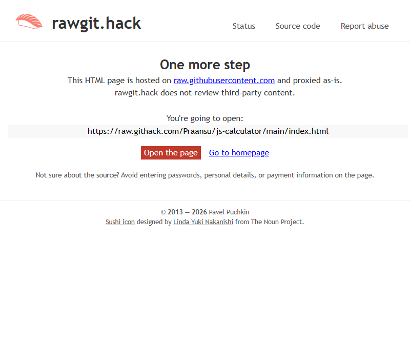

# 🧮 JS Calculator

A browser calculator I built because... well, every developer builds a calculator at some point, right? Might as well make it look good.

🔗 **Live:** [praansu.github.io/js-calculator](https://praansu.github.io/js-calculator)

## What works

- Add, subtract, multiply, divide — the essentials
- Keyboard support (turns out typing numbers is faster than clicking)
- Responsive layout — works on mobile, doesn't break on desktop
- Gradient background and smooth buttons (I spent way too long on the CSS)
- Handles edge cases — division by zero won't crash your browser

## Screenshots

| Clean | In action |
|-------|-----------|
|  |  |

## Quick start

```bash
git clone https://github.com/Praansu/js-calculator.git
cd js-calculator
# Open index.html — no build step, no npm install, no drama
```

## What this taught me

Debugging keyboard events is surprisingly fiddly (e.key vs e.code — who knew?). CSS Grid is great for button layouts. And sometimes the simplest projects teach you the most.

## License

MIT
